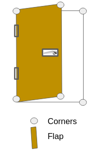

# Door_detection
The door detection is built based on Yolov5 model. And trained using the dataset from https://github.com/MiguelARD/DoorDetect-Dataset

# Detection strategy

Based on the below model, instead of detecting the single door flap as a square, door should described as quandrilateral. Depend on different viewpoint, door will no long fit into a perfect square. So this project is to use yolov5 model to detect all the corners of the door flap and door frame, hinge position and handle position.

Result

The following animation shows door parts detection, including all corners, all door hinges, and handle 

